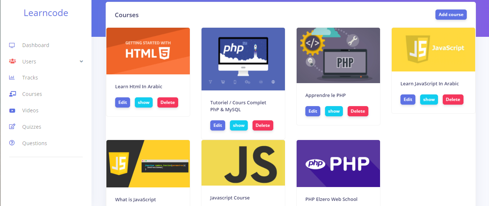

# Application Web : LearnCode

La conception et la réalisation d’une application web e-learning pour apprendre des cours en  informatiques , en utilisant HTML, CSS, Javascript, PHP [Laravel] , et MySQL. 

---
Demo : https://www.youtube.com/embed/ocCb26djMSk
---
## Screenshots

